<picture>
  
</picture>

```
> Sam, Principal Software Engineer; previously DevSecOps Manager.
> Polyglot across Python, TypeScript, C#, Java, Rust.
> Full-stack on frontend and backend, with Postgres on the data side.
> Focused on AI and cloud infrastructure (AWS, GCP).
> Time served in telco and banking.
> B.Sc Computer Science (Software Engineering), B.Eng Robotics and Mechatronics.
> Software, 3D models, and other digital experiments live here.
> Star what you like; collaboration and contributions always welcome.
```


